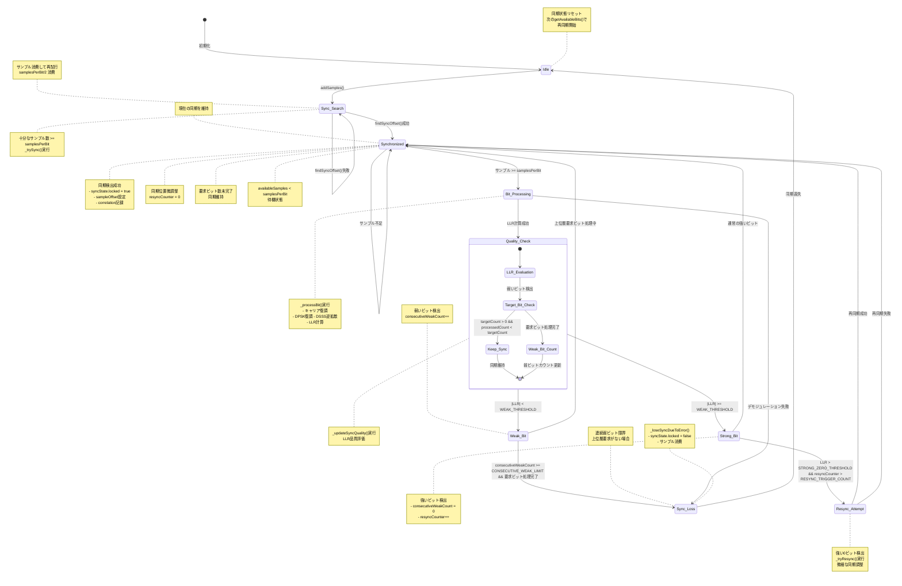

# DSSS-DPSK モデム同期に関するメモ

このドキュメントは、DSSS-DPSK モデムの実装における同期、特に `findSyncOffset` 関数と DPSK 変調の性質に関する重要な考慮事項をまとめたものです。

## DPSK と「位相同期不要」

DPSK (差動位相偏移変調) は、受信機で「位相同期」を必要としないとよく言われます。これは、データ復調のために、受信機が搬送波信号の絶対位相を追跡する必要がないことを指します。代わりに、情報は現在のシンボルの位相と前のシンボルの位相との「差分」で符号化されます。これにより、DPSK は通信チャネルにおける緩やかな位相ドリフトに対して堅牢になります。なぜなら、絶対位相ではなく位相の「変化」のみが重要だからです。

## `findSyncOffset` の役割

DPSK がデータ復調に絶対位相同期を必要としないという特性を持っているにもかかわらず、`findSyncOffset` 関数は**タイミング同期**、そして暗黙的に**搬送波周波数同期**において重要な役割を果たします。

`findSyncOffset` は、マッチドフィルタのアプローチを使用して以下を行います。
1.  **タイミング同期**: 受信信号内で既知のプリアンブル (同期シーケンス) がどこから始まるか、その正確なサンプルオフセットを特定します。
2.  **搬送波周波数同期**: 受信信号と特定の搬送波周波数で変調された参照信号との相関を取ることで、受信信号が実際に期待される搬送波周波数で変調されていることを暗黙的に検証します。

マッチドフィルタは、受信信号とローカルで生成された参照信号との間の最大相互相関を見つけることで動作します。このプロセスは、送信信号と受信信号の間に任意の定数位相オフセットがある場合でも効果的です。なぜなら、相関はプリアンブルの絶対位相ではなく、その*相対的な*位相パターンに敏感だからです。

## プリアンブル設計と同期戦略

この DSSS-DPSK 実装では、`dsssSpread` 関数はビット `0` を元の M シーケンスにマッピングし、ビット `1` を反転した M シーケンスにマッピングします。その後、`dpskModulate` 関数はこれらのチップに基づいて差動位相シフトを適用します。

同期のための重要な設計上の決定は、プリアンブルの構成です。もし**上位レイヤープロトコルが、プリアンブルが常に `0` ビットのシーケンスで構成されることを保証している** (例: 4 ビットの `0`) ならば、以下のようになります。

*   送信されるプリアンブルのチップシーケンスは、常に元の M シーケンス (各 `0` ビットに対して繰り返される) となります。
*   `findSyncOffset` 関数は、この既知の `0` ビット M シーケンスに基づいて単一の参照信号を効率的に生成し、相関を実行できます。このアプローチは、このような厳密なプロトコル保証の下では、有効かつ計算効率が良いです。

この戦略は、特定のプリアンブル設計を活用して同期プロセスを簡素化します。これにより、プリアンブルが任意のビットで構成される可能性がある場合や、`0` ビットの保証がない場合に必要となる、複数の可能なプリアンブルパターン (例: `0` ビットと `1` ビットの両方) との相関を取る必要がなくなります。

## DSSS-DPSK デモジュレータの状態遷移

以下に、`DsssDpskDemodulator` クラスの状態遷移を示します：

### 状態の詳細説明

**主要状態:**
- **Idle**: 初期状態、同期未確立
- **Sync_Search**: 同期検索中、マッチドフィルタによる相関検出
- **Synchronized**: 同期確立済み、ビット処理準備完了
- **Bit_Processing**: 1ビット分のデモジュレーション処理中
- **Quality_Check**: LLR品質評価による同期状態更新
- **Strong_Bit**: 強いビット検出、同期品質良好
- **Weak_Bit**: 弱いビット検出、同期品質低下
- **Resync_Attempt**: 微細な再同期試行（強い0ビット検出時）
- **Sync_Loss**: 同期喪失、再同期が必要

**重要なパラメータ:**
- `WEAK_THRESHOLD`: 弱いビット判定閾値（20）
- `CONSECUTIVE_WEAK_LIMIT`: 連続弱ビット限界（3）
- `STRONG_ZERO_THRESHOLD`: 強い0ビット閾値（50）
- `RESYNC_TRIGGER_COUNT`: 再同期トリガー数（8）

この状態遷移図は、DSSS-DPSK デモジュレータの堅牢な同期管理と適応的な品質制御を示しています。
