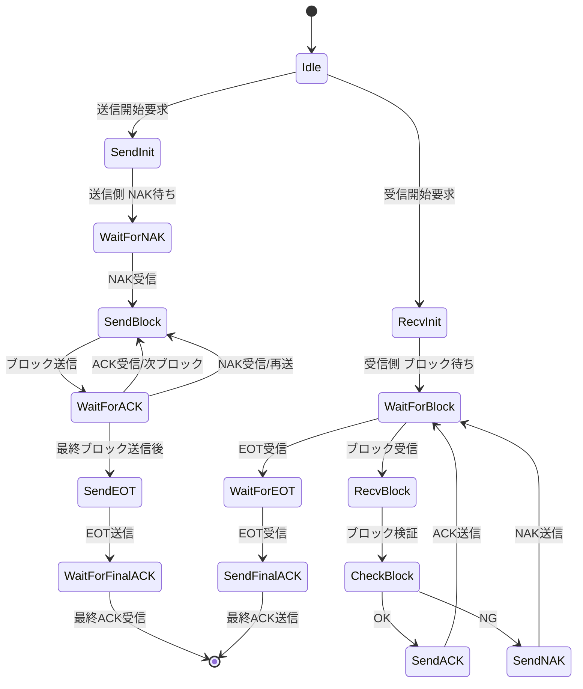

# XModem パケット構造と制御キャラクタ一覧

xmodem そのものではなく xmodem に似せた何かです。

## パケット構造

```
+-----+-----+-------+-------+----------+--------+
| SOH | SEQ | ~SEQ  | LEN   | PAYLOAD  | CRC16  |
+-----+-----+-------+-------+----------+--------+
| 0x01|1-255| 0-255 | 0-255 | 0-255byte| 2byte  |
+-----+-----+-------+-------+----------+--------+
```
- SOH: Start of Header (0x01)
- SEQ: シーケンス番号（1-255）
- ~SEQ: SEQのビット反転（エラー検出用）
- LEN: ペイロード長（0-255）
- PAYLOAD: データ本体
- CRC16: CRC-16-CCITT チェックサム（2バイト）

## 制御キャラクタ一覧

| 名前   | 16進 | 意味                       |
|--------|------|----------------------------|
| SOH    | 0x01 | Start of Header    |
| ACK    | 0x06 | Acknowledge（肯定応答）    |
| NAK    | 0x15 | Negative Ack（再送要求）   |
| EOT    | 0x04 | End of Transmission（終了）|

- 制御キャラクタは1バイト単体で送信され、パケット構造は持ちません。


## 状態遷移図

